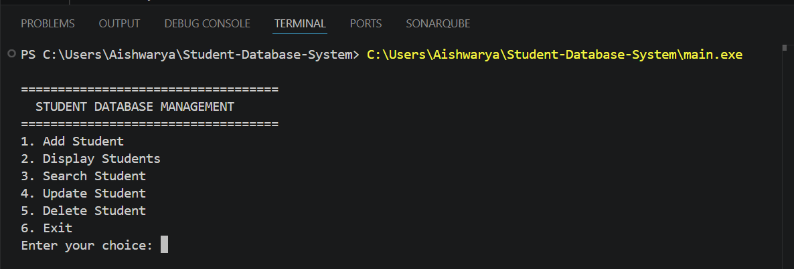
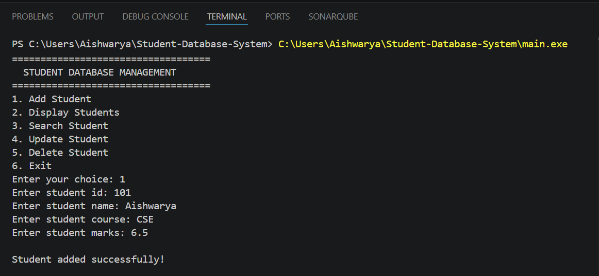
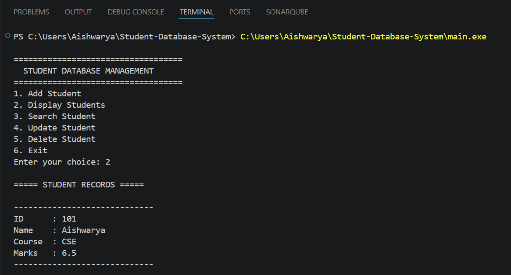
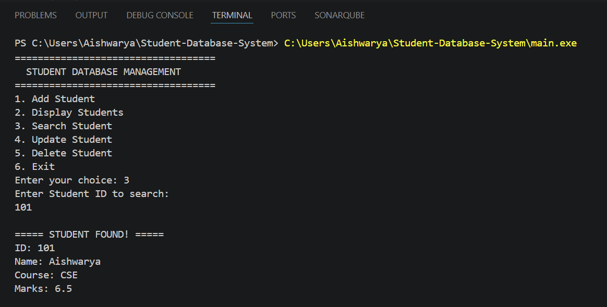
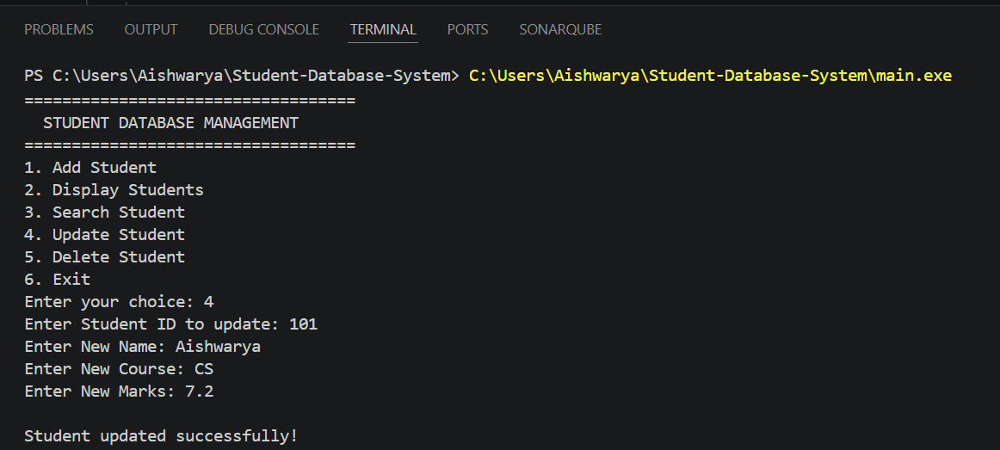
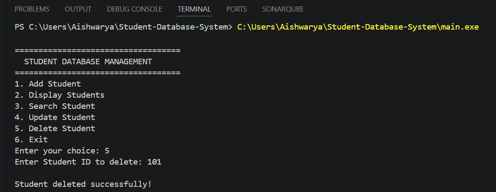

# 🎓 Student Database Management System

A console-based **Student Database Management System** built in **C++** using **Object-Oriented Programming (OOP)** and **File Handling**.

This project was developed to practice core C++ concepts by implementing complete **CRUD (Create, Read, Update, Delete)** operations with persistent data storage using text files.

---

## ✨ Features

* ➕ Add Student Records
* 📋 Display All Students
* 🔍 Search Student by ID
* ✏️ Update Student Details
* 🗑️ Delete Student Records
* ✅ Prevent Duplicate Student IDs
* 💾 Store data permanently using text files

---

## 🛠️ Technologies Used

* C++
* Object-Oriented Programming (OOP)
* File Handling (`ifstream`, `ofstream`)
* Text File Storage

---

## 📚 Concepts Demonstrated

* Classes & Objects
* Functions
* Conditional Statements
* Loops
* File Handling
* CRUD Operations
* Data Validation

---

## 📂 Project Structure

```text
Student-Database-System/
│── main.cpp
│── student.txt
│── README.md
│── screenshots/
```

---

## ▶️ How to Run

1. Compile the program using any C++ compiler (g++, MinGW, or Visual Studio).
2. Run the executable.
3. Select an option from the menu.
4. Manage student records.

---

## 📸 Screenshots

### 🏠 Main Menu



---

### ➕ Add Student



---

### 📋 Display Students



---

### 🔍 Search Student



---

### ✏️ Update Student



---

### 🗑️ Delete Student



---

## 🚀 Future Enhancements

* Store records in a binary file or database
* Search students by name
* Display records in tabular format
* Add attendance and grade management
* Build a graphical user interface (GUI)

---

## 👩‍💻 Author

**Aishwarya**

Computer Science Engineering Student

Built to strengthen C++ programming, Object-Oriented Programming, file handling, and CRUD operations.